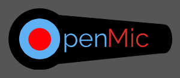

# openMic App Server-side

##### by MANSA SAMLAFO 

  

## Table of Contents
- [About openMic](#About_openMic)
- [Built With](#Built_with)
- [Project Planning](#Project_Planning)
- [Key Features](#Key_Planning)
- [Run app on Computer](#Run_app_on_Computer)
- [Planning Tools](#Planning_Tools)

### About openMic
openMic is a poetry app or media, built to share and showcase poetic talent of all kinds.

### Built With
---------------
1. Node: Was used to build the server
2. PostGres: For storing all the data from the app.
3. Postman: For testing all app endpoints.

## Project Planning:
Trello was for the planning of the app. This listed the different stages and tasks worked through progressively. Through the use of diagram.io, the flow of information and the different components that currently exist in the react front end was created.

## Key Features
In the building of the server, JWT Secret and bcryt were included. Both of these help improve the security of the application and minimize unauthorized processes from users.

To ensure that all requests to the different endpoints where responded to, different conditions and scenarios were considered and responses provided.

## Run app on Computer
To run the application on your computer follow the below instructions:
1. Clone the project from GitHub
2. Open up Visual Studio and paste the link in your command prompt(for mac) or powershell(for windows computer)
3. Run the command "npm init" in the folder created.
4. Then run "npm update" and "npm start" to start the application.

### Planning tools

* Click [openMic diagram.io flow diagram](https://app.diagrams.net/#G1YaAGBeguXZqIiQGxvRm6kFtjt595oe96)

* Click [openMic Tello board](https://trello.com/b/SnWtS2Li/openmic)

                                 
                                <Elevenfifty Academy © MDS 2021>
                                 